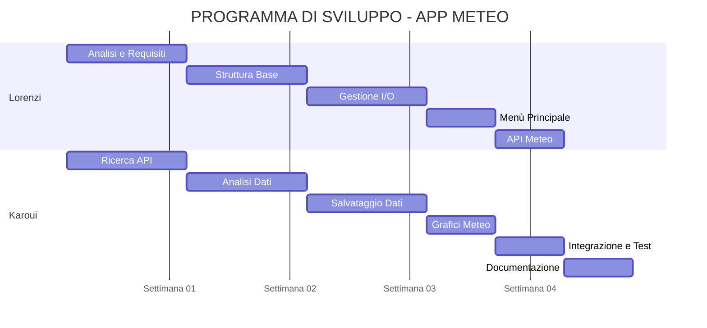

# **Documento dei requisiti - Progetto Meteo e info città - Lorenzi,Karoui**

## **1. Titolo del progetto**
 - Meteo e Info Città

## **2. Obiettivo**
 - Il programma chiede all'utenete di inserire il nome di una città. Di seguito il programma offre un menù che permette all'utente di scegliere se leggere i dati meteorologi e urbani o se visualizzare un grafico del meteo della città scelta.

## **3. Attori**
 - **Utente** → inserisce la città,visualizza meteo e grafici
 - **Sistema** → recupera dati meteo e li elabora

## **4. Requisiti funzionali**
 - Avviare il programma con un menu principale
 - Consentire all’utente di inserire il nome di una città
 - Recuperare i dati meteo tramite API esterna
 - Mostrare temperatura e descrizione del meteo
 - Salvare i dati raccolti in un file CSV
 - Permettere la visualizzazione di un grafico delle temperature

 - Filtrare i dati per città selezionata
 - Gestire errori (città non trovata, file mancante, ecc.)
 - Offrire la possibilità di tornare al menu principale o uscire

## **5. Requisiti non  funzionali**
 - Gestione degli errori per input non validi
- Codice organizzato e modulare
- Utilizzo di librerie esterne affidabile

- Prestazioni adeguate (risposta veloce alle richieste API)
- Salvataggio dei dati tramite file CSV

## **6. Scelta dei package python**
- **requests** → per effettuare richieste HTTP all’API meteo
- **pandas** → per gestire e salvare i dati in formato tabellare

- **matplotlib** → per creare grafici delle temperature

## **7. Suddivisione del lavoro**
- **Lorenzi** → sviluppo menù principale, gestione input/output e implementazione della chiamata API

- **Karoui** → gestione dati meteo,salvataggoio dati e creazione grafici

## **8. Flusso del programma** 

## **9. Cronoprogramma**

# Diagramma di Gantt - App Meteo

